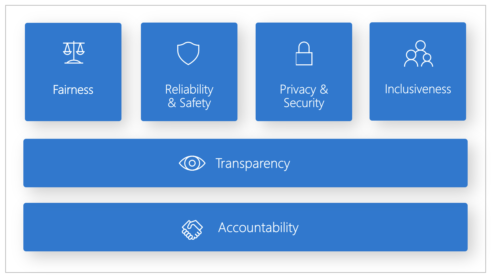

Welcome to Day 2 of 14 Days of Data Science, a countdown to Data Science Day on March 14th.

Today, we delve into an increasingly critical topic: responsible AI. As the power of artificial intelligence continues to permeate every aspect of our lives, it becomes imperative to recognize and uphold the principles of responsible AI development and deployment.

## Understanding Responsible AI

Imagine artificial intelligence (AI) as a powerful toolbox filled with various tools, each designed to help us solve different types of problems. These tools, like intelligent hammers and wrenches, are programmed to learn from data and make decisions or predictions without explicit instructions from humans. Just as a skilled craftsman uses their tools to build and create, AI systems use algorithms and machine learning techniques to analyze data, recognize patterns, and make sense of complex information. Think of AI as a helpful assistant, always ready to lend a hand in tasks ranging from organizing emails to driving cars autonomously. Just like any tool, AI can be incredibly useful when used responsibly and with care, but it's essential to understand its capabilities and limitations to ensure that it benefits society as a whole.

## The Importance of Responsible AI in Data Science

As new technology solutions are created every day, society becomes more reliant on it, whether you're using it directly or not. A lot of these technologies are begining to feature AI heavily, and so the potential of AI to have an impact on peoples' lives is growing rapidly. 

Responsible AI practices are fundamental to building trustworthy, equitable, and sustainable technology ecosystems that work to ensure that the impact that technolgy has is a good one. A few different perspectives to consider for any AI solution are:

1. **Trustworthiness**: Responsible AI fosters trust between users, organizations, and AI systems. By prioritizing transparency, fairness, and accountability, responsible AI practices ensure that users can trust AI technologies to make ethical and reliable decisions.

2. **Fairness and Inclusion**: Responsible AI promotes fairness and inclusion by mitigating biases and ensuring that AI systems do not discriminate against individuals or communities based on factors such as race, gender, or socioeconomic status. By prioritizing fairness, organizations can create AI technologies that benefit everyone equitably.

3. **Legal and Regulatory Compliance**: Responsible AI helps organizations comply with legal and regulatory requirements related to data privacy, security, and non-discrimination. By adhering to responsible AI principles, organizations can avoid legal risks and ensure that their AI systems meet industry standards and regulations.

4. **Risk Mitigation**: Responsible AI practices mitigate risks associated with AI technologies, such as biased decision-making, privacy breaches, and unintended consequences. By proactively addressing these risks, organizations can minimize potential harm to individuals and communities and build more resilient AI systems.

5. **Reputation and Brand Image**: Prioritizing responsible AI enhances organizations' reputation and brand image by demonstrating a commitment to ethical values and societal well-being. By aligning their AI initiatives with responsible practices, organizations can build trust and credibility with customers, partners, and stakeholders.

6. **Innovation and Sustainability**: Responsible AI fosters innovation and sustainability by encouraging ethical and socially responsible AI development. By considering the long-term societal and environmental impacts of AI technologies, organizations can create solutions that contribute positively to society while minimizing negative consequences.

7. **Human-Centered Design**: Responsible AI prioritizes human-centered design principles, ensuring that AI technologies are designed with the needs, values, and preferences of users in mind. By incorporating diverse perspectives and feedback into the AI development process, organizations can create more inclusive and user-friendly AI solutions.

## Embracing Responsible AI Practices

As data scientists and AI practitioners, it is our collective responsibility to embrace and advocate for responsible AI practices. Here are some key principles to guide our efforts:

- **Fairness and Bias Mitigation**: Strive to develop AI systems that are fair, unbiased, and inclusive, considering the diversity of data and perspectives.
- **Transparency and Explainability**: Prioritize transparency and explainability in AI algorithms and decision-making processes, enabling users to understand and trust AI systems.
- **Data Privacy and Security**: Respect individuals' privacy rights and ensure the secure handling of sensitive data throughout the AI lifecycle.
- **Accountability and Governance**: Establish clear accountability mechanisms and governance structures to oversee the development and deployment of AI systems and hold responsible parties accountable for their actions.
- **Continuous Learning and Improvement**: Commit to continuous learning and improvement in responsible AI practices, staying informed about emerging responsible AI statndards, regulations, and best practices.

By embracing responsible AI practices, data scientists can harness the transformative potential of AI while upholding responsible AI standards and promoting the well-being of individuals and society. 

## What's Next?

Tomorrow, you’ll be introduced to the world of machine learning, where you’ll learn about the common methods, approaches, and programming languages for machine learning, as well as the challenges and opportunities of this field.

## Learn More

- To learn more about Responsible AI check out  [Microsoft's Responsible AI Tools and Practices](https://www.microsoft.com/en-us/ai/tools-practices).

## More Data Science at Microsoft

- [Check out the Data Science Cloud Skills Challenge](https://aka.ms/python/DataScienceDay/CSC) if you want to go through some self-paced learning! This challenge is active until April 15th, 2024.
- Join us on Discord at https://aka.ms/python-discord
- [Data Scientist Certifications](https://learn.microsoft.com/credentials/certifications/roles/data-scientist)
- [Data Scientist Training Path](https://learn.microsoft.com/training/career-paths/data-scientist)
