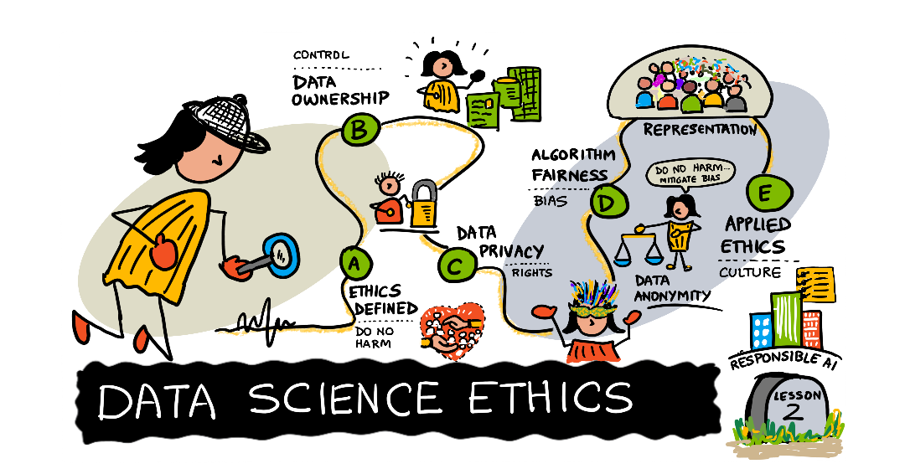
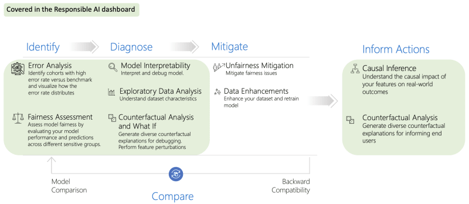

Welcome to `Day 05` of **Developer Tools Week** as we continue our learning journey into Data Science! Today, we'll dive deeper into the concepts of data ethics and a responsible AI. And we'll explore an open-source toolkit and its Azure-integrated solution, for debugging your models and decision-making processes for responsible AI.

## What We'll Learn
1. What is Data Ethics?
1. What is Responsible AI?
1. What is the [Responsible AI Toolbox?](https://responsibleaitoolbox.ai/)
1. Debug your models [with the Responsible AI Dashboard](https://azure.github.io/responsible-ai-hub/docs/rai-dashboard-ms-learn/) 
1. **Assignment**: Explore the [Responsible AI Developer Hub](https://azure.github.io/responsible-ai-hub/)
1. **Resources**: Explore the [2024: Data Science Day Collection](https://bit.ly/2024-datasci-collection)

---

Data analysis leads to machine learning models that power AI algorithms which can make real-world decisions. Automation of these systems means that potential harms can have adverse impact on communities at scale. How can we prevent harmful behaviors and ensure that our systems are safe and trustworthy for our users? This is where concepts like **Data Ethics** and **Responsible AI** come into play.

---

## 1. Understanding Data Ethics

We are all data citizens living in a datafied world. That means every action we take leaves a data trail - from mobile and desktop applications, to IoT devices and social media platforms. This data is collected, stored, and analyzed by organizations, to help them understand user behaviors and build tools and services to support better user experiences or deliver innovative products.

Data ethics is a new branch of ethics that evaluates the _moral issues_ around data processing and AI algorithms in society. _Applied_ ethics focuses on understanding the practical implications of these issues and taking corrective measures to reduce or mitigate potential harms. Establishing an ethics culture (defined by core principles) and enforcing compliance in practice (through guidance, tools and oversight) is key.

🔖| See: [**Introduction To Data Ethics**](https://github.com/microsoft/Data-Science-For-Beginners/blob/main/1-Introduction/02-ethics/README.md).

## 2. Understanding Responsible AI

Responsible AI is approach to developing, assessing, and deploying AI systems in a safe, trustworthy, and ethical way. The [Responsible AI standard](https://www.microsoft.com/ai/principles-and-approach?ocid=buildia24_60days_blogs) was developed by Microsoft as a framework for guiding our design thinking, using six core principles.

_Fairness_ ensures that AI systems allocate opportunities or resources fairly to all humans who use it. _Reliability & Safety_ ensures the system functions correctly in all contexts, including ones it was not designed for. _Privacy & Security_ ensures that an AI system respects privacy and maintains security. _Inclusiveness_ ensures that an AI system is inclusive to people of all abilities. _Transparency_ ensures that people understand the capabilities of the AI system. _Accountability_ ensures that humans are held accountable and remain in control of the AI system.

🔖| See: [**Empowering Responsible AI Practices**](https://www.microsoft.com/ai/responsible-ai).

## 3. The Responsible AI Toolkit

How can we _implement_ these principles in practice? The [Responsible AI Toolbox](https://responsibleaitoolbox.ai/) is a collection of integrated tools and capabilities that can help you _assess_ your models for responsible AI, and _develop_ AI systems in a more safe, trustworthy, and ethical way - with a four-step process:
- **Identify** - fairness & performance issues in your model.
- **Diagnose** - potential causes through data analysis
- **Mitigate** - issues by taking corrective actions.
- **Inform Actions** - by understanding the impact of AI decisions.

The toolbox provides a number of tools (e.g., Error Analysis, Fairness Assessment, Model Interpretability etc.) as shown in the diagram above - each tailored to support the requirements at a particular step of that workflow. The tools can be found in these open-source repositories:

- [Responsible AI Toolbox](https://github.com/microsoft/responsible-ai-toolbox) - with visualization widgets
- [Responsible AI Toolbox Mitigations](https://github.com/microsoft/responsible-ai-toolbox-mitigations) - for underperforming models
- [Responsible AI Toolbox Tracker](https://github.com/microsoft/responsible-ai-toolbox-tracker) - a JupyterLab extension.
- [Responsible AI Toolbix GenBit](https://github.com/microsoft/responsible-ai-toolbox-genbit) - measure gender bias in NLP data.

But how can we _integrate_ and use these diverse tools in a seamless way in our development workflows?

🔖| See: [**Responsible AI Toolbox**](https://responsibleaitoolbox.ai/).

## 4. The Responsible AI Dashboard

This is where the Responsible AI Dashboard comes in. It creates a _single pane of glass_ (dashboard view) into the highlighted tools - allowing you to "flow" through the various stages of model debugging and decision-making in one tool. This includes **Error Analysis** (to identify data cohorts with higher-than-normal error rates), **Fairlearn** (for fairness assessment across cohorts), **InterpretML** (for helping users interpret model behavior),**Counterfactual analysis** (to highlight what feature change would drive a different outcome), and **Causal Analysis** (to understand what-if decision making scenarios).

And while you can use the _open-source_ Responsible AI Dashboard widgets library, the real value comes when we _operationalize it_ by using the _Azure Machine Learning_ integrated version to seamlessly debug your models once created and registered in Azure ML.

🔖| See: [**AzureML: Responsible AI Dashboard**](https://learn.microsoft.com/en-us/azure/machine-learning/concept-responsible-ai-dashboard?view=azureml-api-2).

## 5. Model Debugging For Responsible AI

So how do you go from an open dataset to training your model, then debugging it for responsible AI using the Responsible AI Dashboard? There's a tutorial that walks you through the steps to do just that! 

Check out [our Responsible AI Developer Hub](https://azure.github.io/responsible-ai-hub/docs/rai-dashboard-ms-learn) for links to the tutorial, presentation and a video walkthrough for a Diabetes prediction model.

    

🔖| See: [**Train a model and debug it with RAI Dashboard**](https://aka.ms/mslearn-responsibleai-dashboard).

## 6. Resources 

That was a lot! Want to learn more - check out these three resources:

1. [2024: Data Science Day Collection](https://bit.ly/2024-datasci-collection)
1. [Responsible AI For Developers Collection](https://aka.ms/rai-hub/collection)
1. [Responsible AI For Developers Hub](https://aka.ms/rai-hub/website)